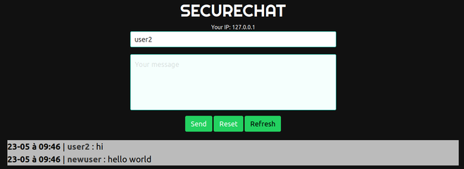

# Minichat PHP

Minichat with vanilla PHP (Openclassrooms course)

## FEATURES

* Adding item with button ✅
* Clear field with button ✅
* Cookie for pseudo (Delete after 2h) ✅
* Empty field checker ✅
* Better style (Framework Bulma) ✅

## Next Features

* Add item with Enter
* Crypted chat (message, ip, macadress)
* Delete self message
* Automatique delete message
